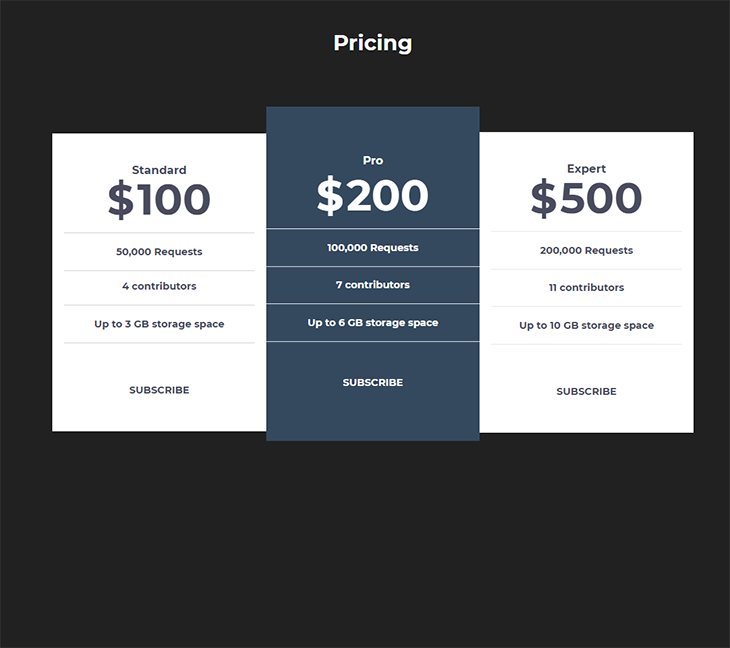

# Task 1



## Goal

1- Recreate the UI as a single React function component (PricingCard.tsx) using TypeScript and TailwindCSS.
2- Props must be:

```ts
plan: string;
price: string;
features: string[];
isFeatured?: boolean;
```

3- Behaviour: stack vertically < 640 px, hover elevation on desktop, full keyboard focus ring.
4- No inline styles; use Tailwind only.
5- Get just the TSX inside tsx fences.

## Model Used

- Gemini 2.5 Pro(preview)
